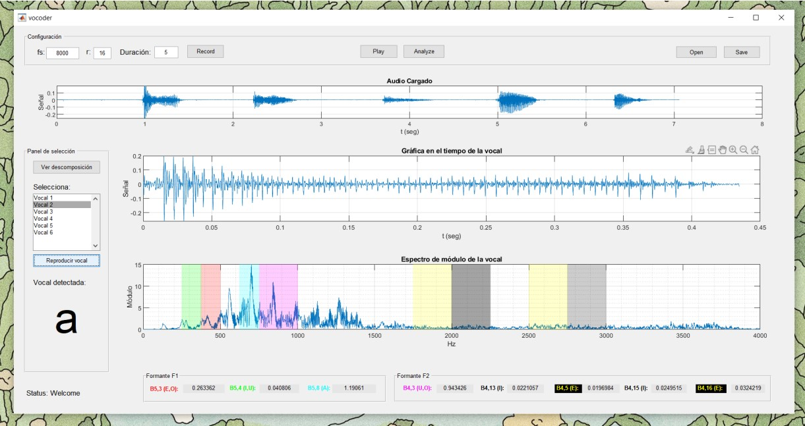

# Vowels detection
Project description: An algorithm to detect all the spanish vowels (a, e, i, o and u) from audio signals using a Six-level wavelet decomposition tree. Implemented using GUIDE/MATLAB.

